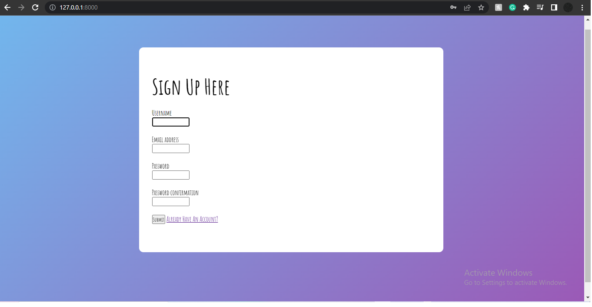
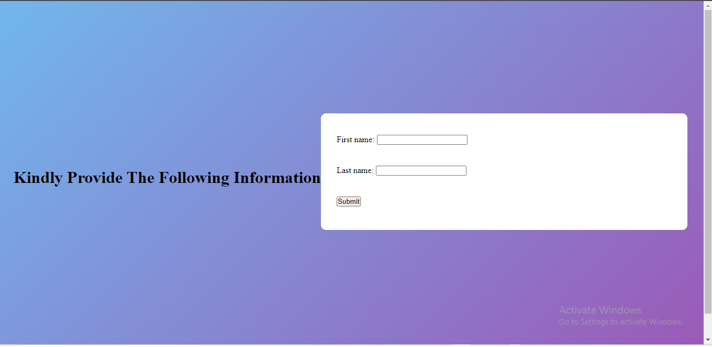
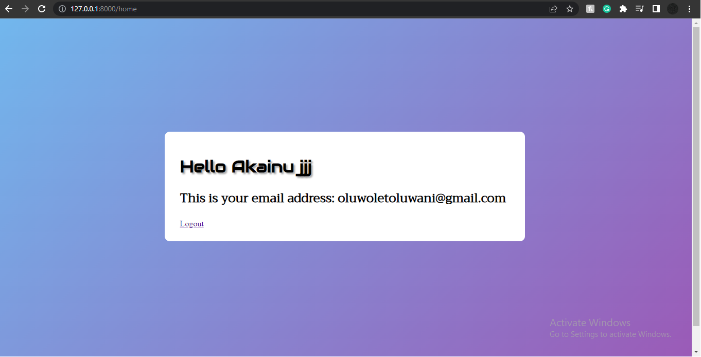
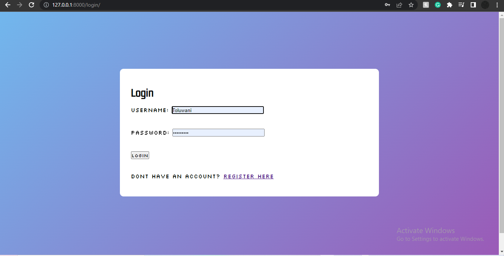

# BackendProject
## Welcome to My Backend Project
#### This project was made using Django(Python Web Framework)

#### The task was to create a login system that will eventually display the user's name and email address after successful registration
### **Python and Django** will need to be installed on your local device in order for it to run 
### Simply type in python manage.py runserver to your terminal to launch

### On server initiation user will be guided to this page to create an account

### After the relevant datails have been input, the user will be required to provide their last name and first name on this page

### Thereafter, the user will be directed to the homepage where their Full name and email address will be displayed

### The user will be given the option to logout and has the ability to login in this page

### If any bugs are found in the program, kindly contact me at oluwoletoluwani@gmail.com
